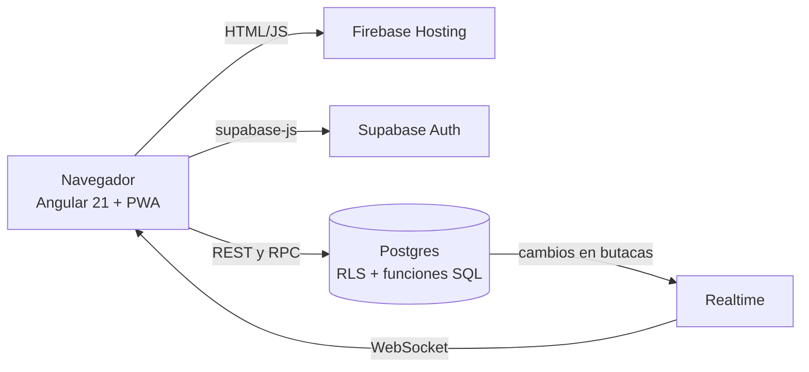

# CineApp

Web de un cine de un solo edificio: cartelera, compra de entradas con mapa de butacas en tiempo real, candy bar, QR en PDF, programa de puntos, combos, preventa y paneles de administrador y empleado.

- **App desplegada:** https://cine-app-magas.web.app
- **Stack:** Angular 21 (standalone, signals, control flow nuevo) · Supabase (Postgres, Auth, Realtime, RLS, RPC) · Firebase Hosting · PWA
- **Trabajo Práctico 1 — Programación IV (UTN)**

## Usuarios de prueba

| Rol | Mail | Contraseña |
| --- | --- | --- |
| Admin | admin@cine.com | 123456 |
| Empleado | empleado@cine.com | 123456 |
| Cliente | cliente1@cine.com | 123456 |

## Cómo correrlo

```bash
cd cine-app
npm install
ng serve          # http://localhost:4200
```

Hay que crear `src/environments/environment.ts` con las claves del proyecto de Supabase:

```ts
export const environment = {
  supabaseUrl: 'https://TU-PROYECTO.supabase.co',
  supabasePublishableKey: 'TU_CLAVE_PUBLICA',
};
```

Para armar la base desde cero, ejecutar en el SQL Editor de Supabase, en este orden, los scripts de `supabase/`:

| Orden | Archivo | Contenido |
| --- | --- | --- |
| 1 | `01-esquema.sql` | Tablas, restricciones, RLS y policies |
| 2 | `02` a `07` | Compras, validación, candy bar, admin de productos, log de funciones, películas y reseñas |
| 3 | `08-funciones-snapshot.sql` | Crédito, canjes, cancelación, consultas del usuario y triggers de log |
| 4 | `11-admin-reportes-log-cupones.sql` | Reportes, log de actividad y cupones del admin |
| 5 | `12-reservas-vencidas.sql` | Barrido de reservas de butacas |
| 6 | `13-perfil-automatico.sql` | Trigger que crea el perfil al registrarse |
| 7 | `14-proximamente-alertas.sql` | Venta abierta 7 días antes y alertas |
| 8 | `15-combos.sql` | Combos con entrada incluida |
| 9 | `16-seguridad.sql` | Permisos por columna y limpieza de policies |

`00-exportar-esquema.sql` es solo una utilidad que exporta el esquema actual.

Despliegue: `ng build` y `firebase deploy --only hosting`.

## Arquitectura

El navegador corre una SPA de Angular que habla directo con Supabase; no hay servidor propio. Toda regla que protege plata o datos vive en Postgres, y Angular se ocupa de la interfaz.



| Capa | Tecnología | Responsabilidad |
| --- | --- | --- |
| Hosting | Firebase Hosting | Sirve la app estática; todas las rutas caen en `index.html` y las resuelve el router |
| Cliente | Angular 21 | Pantallas, rutas con carga diferida, guards y estado de sesión |
| PWA | `@angular/service-worker` | Instalable y con los archivos de la app en caché |
| API | Supabase (PostgREST y RPC) | Lecturas simples con el cliente; operaciones críticas con funciones SQL |
| Tiempo real | Supabase Realtime | Cambios en `butacas_reservadas` y `entradas` llegan a todos los que miran la función |
| Identidad | Supabase Auth | Registro, login y sesión; el rol vive en la tabla `usuarios` |
| Datos | Postgres con RLS | Tablas, restricciones, triggers y funciones `SECURITY DEFINER` |

### Flujo de una compra

1. El usuario elige función y butacas. Cada butaca se reserva en `butacas_reservadas` por 10 minutos; la restricción única de la tabla decide quién ganó si dos personas eligen la misma.
2. Si quiere, suma productos o un combo del candy bar. El carrito guarda solo ids y cantidades.
3. El checkout pide el resumen a `calcular_compra`, que devuelve precios, descuento, combos y crédito. El cliente nunca envía un precio.
4. `confirmar_compra` repite el cálculo y, en una sola transacción, crea la compra, las entradas y los productos, libera la reserva y actualiza puntos y crédito.
5. La confirmación muestra el QR (el UUID de la compra) y genera el PDF con `qrcode` y `jsPDF`.
6. En el cine, el empleado ingresa el código y el servidor valida o entrega, marcando cada uso por separado.

### Estructura del código

```
src/app/
├── core/       AuthService, cliente de Supabase, QR y PDF, guards
├── features/   peliculas · compra · perfil · empleado · admin · auth
├── models/     interfaces TypeScript de cada entidad
└── shared/     navbar, mapa de butacas, pipes y directivas
```

Cada área tiene servicios que encapsulan las llamadas a Supabase; los componentes solo los inyectan con `inject()`. Las rutas se cargan con `loadComponent`.

## Modelo de datos

Son 20 tablas en `public`. Las relaciones están en la base como claves foráneas y restricciones, no solo en el código.

| Grupo | Tablas | Notas |
| --- | --- | --- |
| Usuarios | `usuarios` | Se une 1 a 1 con `auth.users`; guarda rol, puntos y crédito |
| Catálogo | `peliculas`, `generos`, `pelicula_generos` | Una película tiene varios géneros |
| Salas y funciones | `salas`, `funciones` | Formato, idioma, precio, preventa; `hora_fin > hora_inicio` |
| Compra | `compras`, `entradas`, `compra_productos`, `butacas_reservadas` | `entradas` es única por `(funcion_id, fila, columna)`; `compra_productos` congela el precio |
| Candy bar | `categorias_productos`, `productos`, `combos`, `combo_productos` | Cada combo tiene una fila en `productos` con el mismo id |
| Fidelización | `recompensas`, `canjes_puntos` | Cada canje tiene su propio código |
| Marketing | `cupones`, `alertas_pelicula` | Cupón de primera compra y segmentado por edad |
| Social | `resenas` | Una por usuario y película |
| Auditoría | `log_actividad` | Funciones creadas, precios, validaciones y entregas |

En `compras`, el `estado` refleja solo la entrada (`confirmada`, `validada`, `cancelada`). La entrega del candy se marca aparte en `candy_entregado_en`.

## Decisiones técnicas

La decisión de fondo: lo que mueve dinero o datos sensibles se resuelve en la base, no en el navegador, porque el código del cliente lo puede modificar cualquiera.

| Decisión | Por qué | Alternativa descartada |
| --- | --- | --- |
| Precios, descuentos, crédito y puntos se calculan en funciones SQL | El cliente solo envía ids y cantidades; no puede manipular un total | Calcular en Angular y enviar el total |
| `confirmar_compra` en una sola transacción | O se crea todo o no se crea nada | Varios `insert` desde el cliente |
| `calcular_compra_base` más un envoltorio `calcular_compra` | Crédito, función iniciada y combos se agregaron sin romper el cálculo base | Una sola función cada vez más larga |
| Reserva de butacas con vencimiento de 10 minutos y restricción única | La base decide quién gana si dos eligen a la vez | Validar solo en el cliente |
| Realtime para el mapa | Todos ven las butacas ocupadas sin recargar | Consultar cada pocos segundos |
| Barrido de reservas vencidas al reservar | Una reserva vieja bloqueaba la butaca por la restricción única; no hace falta un proceso aparte | Un cron obligatorio (queda como opción con `pg_cron`) |
| Perfil creado por un trigger sobre `auth.users` | Registro atómico; rol, puntos y crédito nunca los decide el cliente | Insertar el perfil desde Angular tras el `signUp` |
| RLS en todas las tablas y escrituras sensibles solo por RPC | El front no puede saltarse las reglas | Confiar en esconder botones |
| Permisos por columna en `usuarios` | Solo se editan nombre, apellido, sangre, ojos y vacaciones | Una policy de `UPDATE` abierta sobre toda la fila |
| Combo como producto virtual con el mismo id | Viaja por carrito, QR, entrega y reportes sin tocar `confirmar_compra` | Un flujo de compra paralelo |
| Zona horaria `America/Argentina/Buenos_Aires` en cada función; la base guarda UTC | "Hoy", "2 horas antes" y "7 días" dependen de la hora local del cine | Hora del servidor o del navegador |
| Una función no puede cruzar la medianoche | Simplifica la superposición; la pantalla avisa el último horario posible | Funciones de varios días |
| Excel exportado como CSV con `;` y BOM UTF-8 | Excel lo abre con las tildes bien, sin una librería más | Librería de `.xlsx` |
| PDF con `jsPDF` cargado de forma diferida; gráficos en HTML y CSS | Solo se usa lo visto en la cátedra y no pesa en la carga inicial | Librería de gráficos |
| Alertas de "avisame" dentro de la app (campana) | Funciona sin infraestructura extra | Mail o push |

### Angular

- **Standalone y signals** en toda la app: `signal`, `computed` y `effect` para sesión, filtros y carrito.
- **Control flow nuevo** (`@if`, `@for`, `@empty`).
- **Rutas con `loadComponent`** y guards funcionales (`authGuard`, `empleadoGuard`, `adminGuard`).
- **Pipes propios:** `duracion`, `generos`, `estrellas`, `precioConDescuento` y `fecha`.
- **Directivas propias:** `*appSoloAdmin` (estructural) y `appVipHighlight` (atributo). La seguridad real la ponen las RLS y los guards.

## Reglas de negocio

El total se arma siempre en el servidor, en este orden:

1. **Precio base:** el de preventa mientras `hoy ≤ fecha_fin_preventa`; después, el normal.
2. **Tipo de butaca:** J y K accesibles, R, S y T VIP (×1,5), el resto estándar.
3. **Descuento:** solo usuarios logueados y solo sobre entradas. Se toma el mayor porcentaje aplicable entre primera compra y segmentado por edad.
4. **Candy:** nombre y precio salen de la tabla, hasta 20 unidades por producto.
5. **Combos con entrada:** por cada combo, la butaca más barata queda en $0 y se cobra el precio fijo del combo.
6. **Crédito:** se descuenta del total hasta cubrirlo.
7. **Puntos:** 1 por peso pagado, `floor(total − crédito aplicado)`.

| Situación | Qué hace el sistema |
| --- | --- |
| Película con restricción y usuario logueado menor | Bloqueo en el servidor |
| Película con restricción y comprador anónimo | Puede comprar aceptando el aviso; el comprobante indica que debe ir un adulto |
| Función que ya comenzó | No se pueden comprar entradas |
| Estreno a más de 7 días | Un trigger en `entradas` impide la venta, aunque se llame a la API directo |
| Cancelación hasta 2 horas antes | Libera butacas, el total vuelve como crédito y se restan los puntos dados |
| Cancelación con candy retirado, entrada validada o menos de 2 horas | Se rechaza |
| QR ya usado | Se rechaza; entrada y candy se gastan por separado |
| Crear una función | Primera sala sin otra función a menos de 30 minutos |

## Seguridad y permisos

La clave pública de Supabase viaja en el navegador, así que todo lo que protege la app son las políticas RLS y las funciones del servidor.

| Rol | Puede | No puede |
| --- | --- | --- |
| Anónimo | Ver cartelera, reseñas y combos; reservar butacas; comprar | Usar crédito, cupones o puntos |
| Cliente | Lo anterior, más sus compras, cancelaciones, crédito, puntos, canjes, reseñas y alertas | Cambiar su rol, puntos, crédito o fecha de nacimiento |
| Empleado | Validar entradas, entregar candy y canjes | Modificar catálogo, precios, reportes o log |
| Admin | Todo, incluidos reportes y log | — |

- RLS activada en las 20 tablas; la escritura de catálogo, precios y configuración queda limitada a `is_admin()`.
- Sin `INSERT` directo en `compras` ni `entradas`: solo `confirmar_compra`.
- Funciones `SECURITY DEFINER` con `search_path` fijo, que verifican el rol antes de actuar.
- Bloqueos de fila (`for update`) en compra, cancelación y canje, para que dos pedidos simultáneos no gasten dos veces el mismo crédito o los mismos puntos.

## PWA

`@angular/service-worker` con `ngsw-config.json` y `manifest.webmanifest`; el service worker se activa solo en producción. Si en una prueba se ve una versión vieja, abrir en incógnito o desregistrar el service worker.

## Limitaciones conocidas

| Tema | Estado actual | Mejora |
| --- | --- | --- |
| Superposición de funciones | El margen de 30 minutos se valida en el cliente | Restricción `EXCLUDE` en Postgres |
| Pago | Simulado, sin pasarela | Integrar un medio de pago |
| Alertas | Dentro de la app | Mail o push |
| Excel | CSV compatible con Excel | `.xlsx` real |
| Lectura de QR | Lector USB o tipeo | Cámara del celular |
| Preventa | Por función | Aplicar a todas las funciones de una película |
| Productos más vendidos | Un combo cuenta con su precio completo | Descomponer el combo |
| Mapa del cine | No implementado, sin luz verde del cliente | — |
